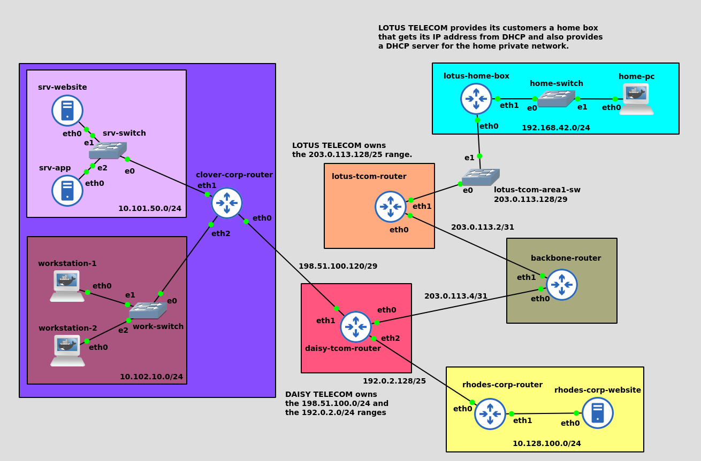
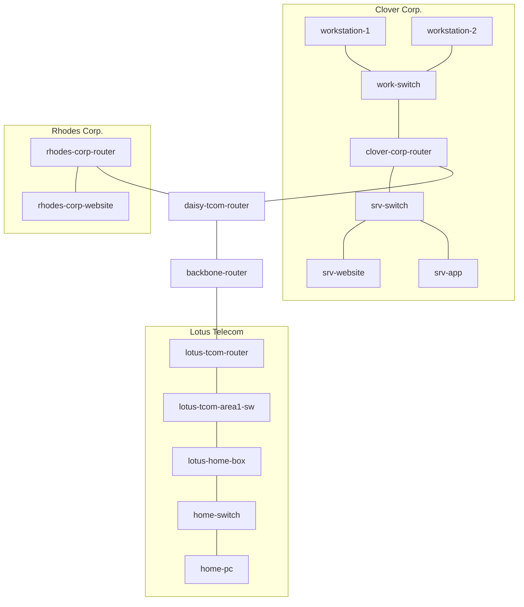

# net1-topology-lab

Simulation réseau GNS3 : interconnexion de deux entreprises, deux fournisseurs d'accès (FAI) et un réseau domestique, avec adressage public/privé réaliste, NAT et filtrage.

## Sommaire

- [Contexte](#contexte)
- [Topologie](#topologie)
- [Plan d'adressage](#plan-dadressage)
- [Routage](#routage)
- [Pare-feu / NAT](#pare-feu--nat)
- [Lancer le projet](#lancer-le-projet)

## Contexte

Le projet simule une situation réseau réaliste où plusieurs entités sont interconnectées :

- **Clover Corp.** — entreprise avec un réseau serveurs et un réseau bureautique, connectée via Daisy Telecom
- **Rhodes Corp.** — entreprise n'hébergeant qu'un site web, connectée via Daisy Telecom
- **Daisy Telecom** — FAI professionnel desservant Clover Corp. et Rhodes Corp.
- **Lotus Telecom** — petit FAI grand public desservant un réseau domestique
- **Backbone** — cœur de réseau reliant les deux FAI entre eux

Les réseaux locaux utilisent des adresses privées (`10.0.0.0/8`, `192.168.0.0/16`), non routables sur "Internet" : tout trafic sortant passe par du NAT (SNAT ou MASQUERADE) pour être traduit en adresse publique.

## Topologie

| Nœud | Type | Rôle |
|---|---|---|
| clover-corp-router | routeur | passerelle Clover Corp., NAT + pare-feu |
| workstation-1 / 2 | poste client | bureautique Clover Corp. (DHCP) |
| srv-website / srv-app | serveur | services hébergés par Clover Corp. |
| rhodes-corp-router | routeur | passerelle Rhodes Corp., NAT |
| rhodes-corp-website | serveur | site web Rhodes Corp. |
| daisy-tcom-router | routeur | FAI professionnel (Clover + Rhodes) |
| backbone-router | routeur | cœur de réseau inter-FAI |
| lotus-tcom-router | routeur | FAI grand public (DHCP clients) |
| lotus-home-box | routeur | box internet, NAT (MASQUERADE) |
| home-pc | poste client | réseau domestique (DHCP) |

## Plan d'adressage

| Réseau | Plage | Interface |
|---|---|---|
| Clover — serveurs | `10.101.50.0/24` | clover-corp-router eth1 |
| Clover — bureautique | `10.102.10.0/24` | clover-corp-router eth2 (DHCP) |
| Rhodes — serveurs | `10.128.100.0/24` | rhodes-corp-router eth1 |
| Lotus — domicile | `192.168.42.0/24` | lotus-home-box eth1 (DHCP) |
| Daisy ↔ Clover | `198.51.100.120/29` | — |
| Daisy ↔ Rhodes | `192.0.2.128/25` | — |
| Daisy ↔ Backbone | `203.0.113.4/31` | — |
| Backbone ↔ Lotus | `203.0.113.2/31` | — |
| Lotus (zone 1, clients FAI) | `203.0.113.128/29` | lotus-tcom-router eth1 (DHCP) |

## Routage

Chaque routeur "feuille" (clover-corp-router, rhodes-corp-router, lotus-tcom-router) pointe une route par défaut vers son fournisseur en amont. Les routeurs qui agrègent plusieurs sous-réseaux clients déclarent des routes statiques explicites :

- **daisy-tcom-router** connaît les LAN internes de Clover et Rhodes, et la plage publique de Lotus
- **backbone-router** connaît les deux plages appartenant à chaque FAI (`198.51.100.0/24` + `192.0.2.0/24` pour Daisy, `203.0.113.128/25` pour Lotus)

## Pare-feu / NAT

| Nœud | NAT | Pare-feu |
|---|---|---|
| clover-corp-router | DNAT :80 → srv-website · SNAT (IP fixe) | ICMP seul vers le routeur · deny serveurs→bureautique · HTTP autorisé vers le subnet serveurs |
| rhodes-corp-router | DNAT :80 → rhodes-corp-website · SNAT (IP fixe) | — |
| lotus-home-box | MASQUERADE (IP publique dynamique) | — |

## Lancer le projet

1. Importer `project.gns3project` dans GNS3 (nécessite l'accès au registre Docker `registry.cri.epita.fr`)
2. Démarrer tous les nœuds
3. Vérifier que les routes et règles `iptables` sont bien chargées sur chaque routeur (`ip route`, `iptables -L -n`, `iptables -t nat -L -n`)
4. Tester la connectivité de bout en bout (ex. `home-pc` → site web `srv-website` via l'IP publique de clover-corp-router)
